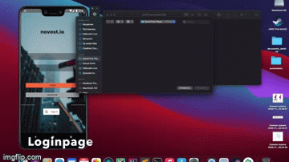
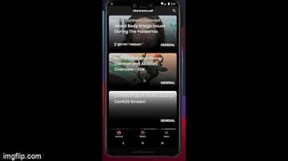
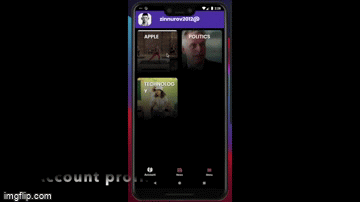

<h1 align="left">
   
  NOVOST.IO
   
</h1>

## Android news app

Individual project which allows user to read news. 
App allows user to customize  news category.

## Installing
Download apk file or put the packages to the android studio 

## Key Features
* Downloading News as PDF file
* Swipe animations to delete news
* 2 step verification 
* Dark-mode 

## Structure
### Login Page for users:

### Main news actcivity:

### Account page:

## Built With

* [Firebase](https://firebase.google.com) - Platform for creating apps
* [NewsApi](https://newsapi.org) - Api for getting JSON data

## Authors
Arthur Zinnurov(https://gitlab.com/ZinnurovArtur)

## License

MIT

